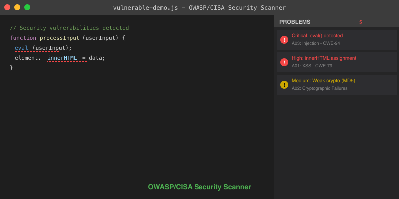

# OWASP/CISA Security Scanner

[](https://marketplace.visualstudio.com/items?itemName=AegisQ.owasp-cisa-security-scanner)
[](https://marketplace.visualstudio.com/items?itemName=AegisQ.owasp-cisa-security-scanner)
[](https://marketplace.visualstudio.com/items?itemName=AegisQ.owasp-cisa-security-scanner)
[](https://opensource.org/licenses/MIT)

A comprehensive VS Code extension that scans your code for security vulnerabilities based on the OWASP Top 10, OWASP LLM Top 10, and CISA Secure by Design principles.



*Security issues detected in the Problems panel with severity ratings and remediation advice*

## 🛡️ Features

- **Comprehensive Security Analysis**: Detects 60+ types of security vulnerabilities
- **OWASP Top 10 Coverage**: Complete coverage of all OWASP Top 10 categories
- **OWASP LLM Top 10**: GenAI/LLM security vulnerability detection
- **CISA Secure by Design**: Implements CISA's secure coding principles
- **Real-time Scanning**: Auto-scan on file save and open
- **Multi-language Support**: JavaScript, TypeScript, Python, Java, C#, PHP, Ruby, Go, C/C++
- **AI/ML Security**: Specialized detection for GenAI and LLM applications
- **Detailed Remediation**: Specific fix recommendations with CWE classifications
- **Severity Classification**: Critical, High, Medium, and Low severity ratings

## 🚀 Installation

1. Open VS Code
2. Go to Extensions (Ctrl+Shift+X)
3. Search for "OWASP CISA Security Scanner"
4. Click Install

## 📖 Usage

### Automatic Scanning
Files are automatically scanned when:
- Opening a file
- Saving a file (with 500ms debounce)

### Manual Scanning
- **Right-click** in editor → "Scan for Security Issues"
- **Command Palette** (Ctrl+Shift+P) → "OWASP/CISA: Scan for Security Issues"

### View Results
- Security issues appear as red squiggles in the editor
- View all issues in the **Problems** panel (View → Problems)
- Hover over issues for detailed remediation advice

## 🔍 Detected Vulnerabilities

### OWASP Top 10 Coverage
- **A01: Broken Access Control** - XSS prevention, unsafe HTML assignment
- **A02: Cryptographic Failures** - Weak hashing (MD5, SHA-1), insecure random
- **A03: Injection** - Code injection (eval, Function), XSS, template injection
- **A04: Insecure Design** - Timing attack vulnerabilities
- **A05: Security Misconfiguration** - CORS misconfigurations
- **A06: Vulnerable Components** - Dependency management issues
- **A07: Identity/Authentication Failures** - Hardcoded credentials, JWT issues
- **A08: Software/Data Integrity Failures** - Unsafe JSON parsing, prototype pollution
- **A09: Security Logging Failures** - Sensitive information logging
- **A10: Server-Side Request Forgery** - Unsafe HTTP requests

### OWASP LLM Top 10
- **LLM01: Prompt Injection** - User input in prompts, template injection
- **LLM02: Insecure Output Handling** - Unvalidated LLM output, code execution
- **LLM03: Training Data Poisoning** - Untrusted training data sources
- **LLM04: Model Denial of Service** - Resource exhaustion, infinite loops
- **LLM06: Sensitive Information Disclosure** - Secrets in prompts/outputs
- **LLM07: Insecure Plugin Design** - Dynamic function calls, unsafe plugins
- **LLM08: Excessive Agency** - Unchecked AI autonomy, bypass controls
- **LLM09: Overreliance** - Critical decisions without validation
- **LLM10: Model Theft** - Insecure model storage and endpoints

### CISA Secure by Design
- **Input Validation** - parseInt without radix, path traversal
- **Memory Safety** - Buffer allocation issues, deprecated constructors
- **Default Security** - Environment variable handling
- **Command Injection** - Child process execution risks

## ⚙️ Configuration

Configure the scanner in VS Code settings:

```json
{
    "owaspCisaScanner.enableAutoScan": true,
    "owaspCisaScanner.maxFileSize": 5242880,
    "owaspCisaScanner.enableHighSeverityOnly": false
}
```

## 🛠️ Development

### Prerequisites
- Node.js 16+
- VS Code 1.74+

### Building from Source
```bash
# Clone the repository
git clone https://github.com/JeffGrayson1969/owasp-cisa-security-scanner.git
cd owasp-cisa-security-scanner

# Install dependencies
npm install

# Compile
npm run compile

# Run security checks
npm run security-check

# Debug in VS Code
code .
# Press F5 to start debugging
```

### Testing
```bash
# Run tests
npm test

# Run security audit
npm run security-audit
```

## 📊 Example Detection

```javascript
// ❌ Critical: Code Injection
eval(userInput);

// ❌ Critical: Hardcoded Credentials
const password = "admin123";

// ❌ High: XSS Vulnerability
element.innerHTML = userData;

// ❌ Critical: Weak Cryptography
crypto.createHash("md5");

// ❌ High: Sensitive Logging
console.log("User password:", userPass);

// ❌ Critical: LLM Prompt Injection
const prompt = `Hello ${userInput}, help me with: ${userRequest}`;

// ❌ Critical: Executing LLM Output
eval(llmResponse.choices[0].message.content);

// ❌ Critical: Sensitive Data in Prompts
const messages = [{ role: "user", content: `My API key is ${apiKey}` }];

// ✅ Secure Alternatives
JSON.parse(userInput);
const password = process.env.DB_PASSWORD;
element.textContent = userData;
crypto.createHash("sha256");
console.log("User logged in successfully");

// ✅ Secure LLM Usage
const prompt = sanitizeInput(`Hello ${userInput}`);
const validatedOutput = validateLLMResponse(llmResponse);
const messages = [{ role: "user", content: anonymizeData(userRequest) }];
```

## 🤝 Contributing

Contributions are welcome! Please read our [Contributing Guidelines](CONTRIBUTING.md) first.

### Adding New Rules
1. Add rule to `src/securityRules.ts`
2. Include OWASP/CISA categorization
3. Provide clear remediation advice
4. Add test cases
5. Update documentation

## 📄 License

This project is licensed under the MIT License - see the [LICENSE](LICENSE) file for details.

## 🙏 Acknowledgments

- [OWASP Top 10](https://owasp.org/www-project-top-ten/) for vulnerability classifications
- [OWASP LLM Top 10](https://owasp.org/www-project-top-10-for-large-language-model-applications/) for GenAI security
- [CISA Secure by Design](https://www.cisa.gov/secure-by-design) for security principles
- [CWE Database](https://cwe.mitre.org/) for weakness classifications

## 🔗 Links

- [VS Code Marketplace](https://marketplace.visualstudio.com/items?itemName=AegisQ.owasp-cisa-security-scanner)
- [GitHub Repository](https://github.com/JeffGrayson1969/owasp-cisa-security-scanner)
- [GitHub Issues](https://github.com/JeffGrayson1969/owasp-cisa-security-scanner/issues)
- [OWASP Foundation](https://owasp.org/)
- [CISA](https://www.cisa.gov/)

## Looking for more?

This extension runs a regex-based ruleset entirely client-side, and it's **free forever**. If you need deeper analysis or team workflows, **AegisQ-CodeShield** is the paid upgrade. It adds:

- **LLM-powered scanning** — context-aware vulnerability detection beyond static patterns
- **Auto-fix with diff preview** — review suggested remediations before applying
- **OWASP / CISA / CWE compliance reports** — exportable for audits
- **MCP server** — use the same scanner from Claude Code, Cursor, and Windsurf
- **License management** — centralized for teams and organizations

### Plans

Both paid plans include **every** feature above — the difference is how many people are covered:

- **Pro** — for an **individual developer**. Full CodeShield for a single user.
  - **$19/month** — [Subscribe monthly](https://buy.stripe.com/6oUbJ1cnHaT3bskgfB4Rq00)
  - **$190/year** ([2 months free](https://buy.stripe.com/4gM3cv0EZgdn0NG0gD4Rq01)) — best value
- **Team** — for a **whole team or organization**. Everything in Pro, plus **multiple seats** and centralized license management.
  - **$49/month** — [Subscribe monthly](https://buy.stripe.com/9B6fZhbjD6CN9kc7J54Rq02)
  - **$490/year** ([2 months free](https://buy.stripe.com/4gMaEXevPaT30NGgfB4Rq03)) — best value

The free Marketplace extension stays standalone and shares its ruleset with CodeShield via the [`@aegisq-codeshield/security-rules`](https://www.npmjs.com/package/@aegisq-codeshield/security-rules) package, so detections stay in sync.

---

**Stay Secure!** 🛡️